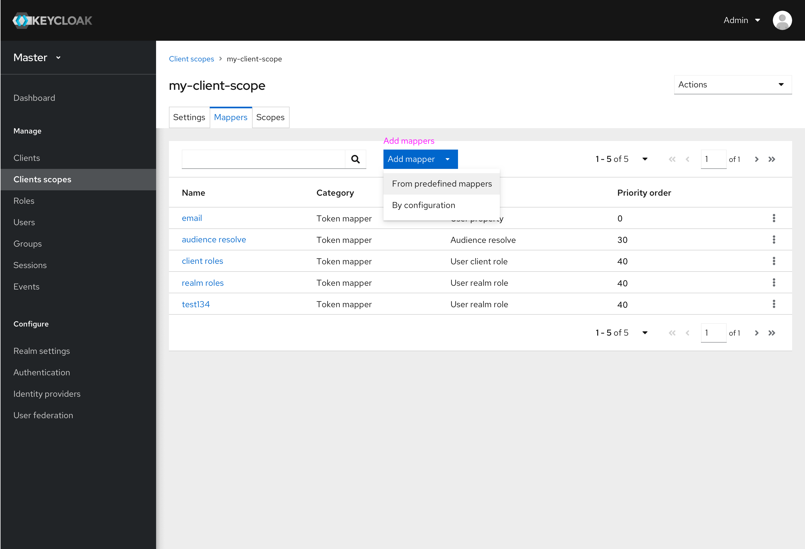
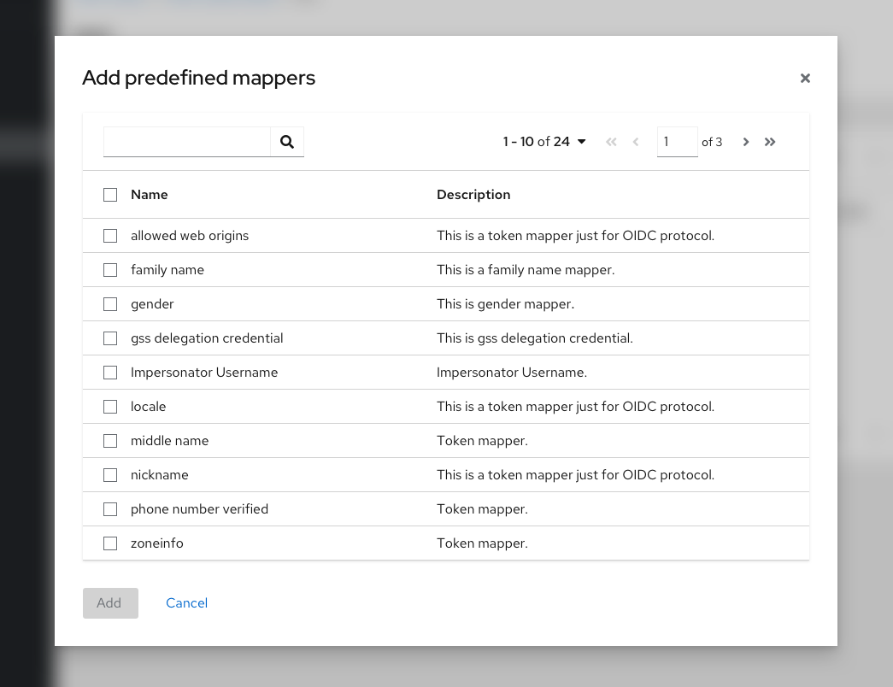
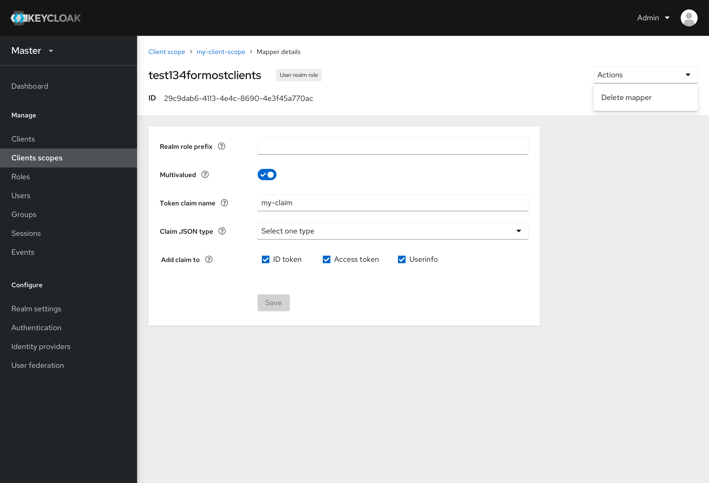

# Mappers

In the current console, there are 2 methods to add mappers. Users can add builtin(predefined) mappers or create a new mapper. In the new design, creating a new mapper has been divided into two steps: choose a mapper type first, and then configure the new mapper based on the chosen mapper type. Because the protocol is not allowed to be changed, this field has been removed.

In this document, there are two parts. The first is  how to add new mappers. We used a preliminary toggle to choose how to add one or more mappers. Second, there are some new designs about how to configure a new mapper based on 3 specific mapper types.

### Two methods of adding mappers

Users can click the preliminary toggle and there are two methods for them: (1)add mapper from predefined mappers and (2)add mapper by configuration.
* Add mapper from predefined mappers. There are some predefined mappers provided by Keycloak for users to choose from.

* Add mapper by configuration
  * Step1: Choose a mapper type. There is a list for users. Users can click one specific mapper type and enter the configuration page. Different mapper types have different configurations.
  

  * Step2: Configure this new mapper. Protocol has been removed. Users can fill out this form and save it.
  

  * Notes: Edit the mapper. After saving the new mapper or clicking the mapper name in the mapper list, users can edit the mapper, like the picture below. The label indicates the mapper type.
  

### Configuration of three mapper types
* Mapper type - User address: This is a long form. In the new design, ID token, access token and userinfo have been grouped in a row.

* Mapper type - Role name mapper:
  * Users can select a role from realm or a specific client. This is not a required field. Like the picture shows below. Users can select realm or client and then choose a role.  Support for searching clients.
  

  * Select a role or type some letters to choose  a role.
  

* Mapper type - User client role. There are two ways for users to select a client:
  * Click the dropdown toggle and select one client in the option list.
  * Type some letters to search and fuzzy search is supported.
  
